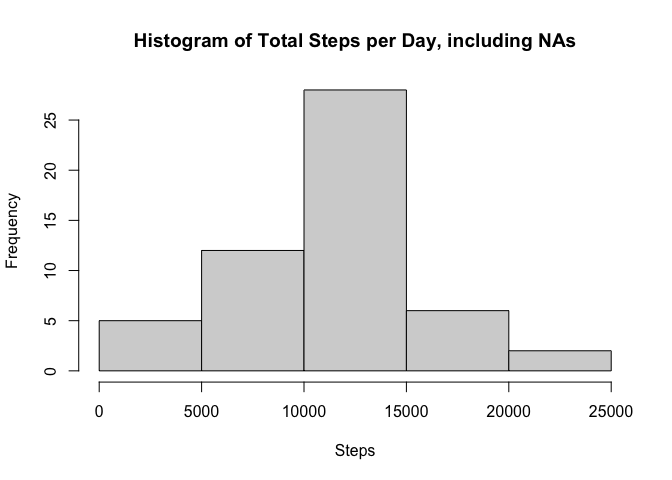
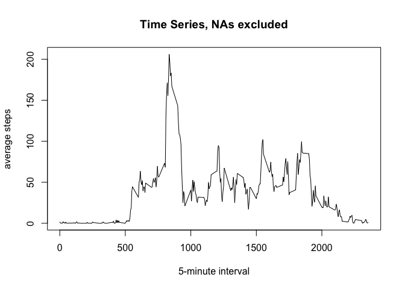
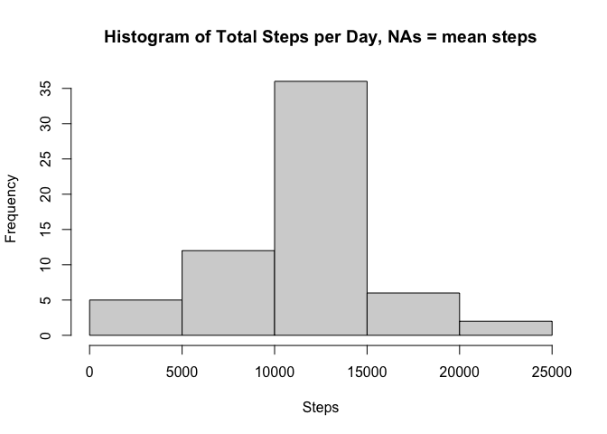
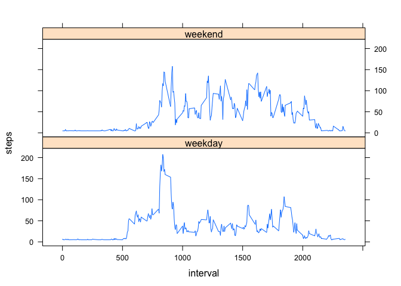

## Loading and preprocessing the data

```r
data <- read.csv("activity.csv")
str(data)
```

```
## 'data.frame':	17568 obs. of  3 variables:
##  $ steps   : int  NA NA NA NA NA NA NA NA NA NA ...
##  $ date    : chr  "2012-10-01" "2012-10-01" "2012-10-01" "2012-10-01" ...
##  $ interval: int  0 5 10 15 20 25 30 35 40 45 ...
```

## What is mean total number of steps taken per day?

```r
byday <- tapply(data$steps, data$date, sum)

hist(byday, main = "Histogram of Total Steps per Day, including NAs",
     xlab = "Steps")
```

<!-- -->

```r
summary(byday)
```

```
##    Min. 1st Qu.  Median    Mean 3rd Qu.    Max.    NA's 
##      41    8841   10765   10766   13294   21194       8
```


## What is the average daily activity pattern?

```r
interval <- tapply(data$steps, data$interval, mean, na.rm = TRUE)
timeaverage <- data.frame(interval = names(interval), steps = interval,
                          row.names = NULL)
with(timeaverage, plot(interval, steps, type = "l", 
                                   main = "Time Series, NAs excluded",
                                   ylab = "average steps",
                                   xlab = "5-minute interval"))
```

<!-- -->

```r
timeaverage[which.max(timeaverage$steps),]  
```

```
##     interval    steps
## 104      835 206.1698
```
The time interval at 835 minutes has the highest step value averaged across all 
days (~206 steps).

## Imputing missing values

```r
nasteps <- is.na(data$steps)
sum(nasteps)
```

```
## [1] 2304
```
There are 2304 missing 'step' values in the data set. These can be imputed using
the overall mean step value (37.3826).


```r
data2 <- data
data2$steps[is.na(data2$steps)] <- mean(data2$steps, na.rm = TRUE)

byday2 <- tapply(data2$steps, data2$date, sum)

hist(byday2, 
     main = "Histogram of Total Steps per Day, NAs = mean steps",
     xlab = "Steps")
```

<!-- -->

```r
summary(byday2)
```

```
##    Min. 1st Qu.  Median    Mean 3rd Qu.    Max. 
##      41    9819   10766   10766   12811   21194
```
Imputing the missing values with the mean step count has a negligible impact on 
the data as a whole. The median value changes slightly. 

## Are there differences in activity patterns between weekdays and weekends?

```r
data2$date <- as.Date(data2$date)
data2$day <- weekdays(data2$date)

weekdays <- c("Monday", "Tuesday", "Wednesday", "Thursday", "Friday")

data2$wkend <- ifelse(data2$day %in% weekdays, "weekday", "weekend")
weekdaysteps <- data2[data2$wkend == "weekday",]
weekendsteps <- data2[data2$wkend == "weekend",]

wkday_interval <- tapply(weekdaysteps$steps, weekdaysteps$interval, mean, 
                         na.rm = TRUE)

wkend_interval <- tapply(weekendsteps$steps, weekendsteps$interval, mean, 
                         na.rm = TRUE)

wkday_intervaldata <- data.frame(interval= names(wkday_interval),
                                 steps= wkday_interval,
                                 day= "weekday", row.names = NULL)
wkend_intervaldata <- data.frame(interval= names(wkend_interval),
                                 steps= wkend_interval,
                                 day= "weekend", row.names = NULL)

data3 <- rbind(wkday_intervaldata, wkend_intervaldata)
data3$interval <- as.numeric(data3$interval)
data3 <- data3[order(data3$day),]
library(lattice)
xyplot(steps ~ interval | day, data=data3, type = "l", layout = c(1,2))
```

<!-- -->

